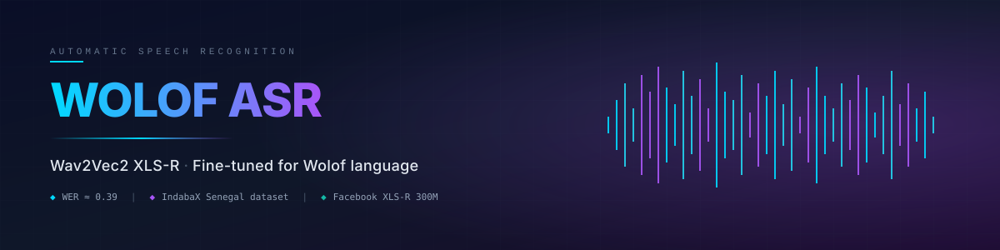
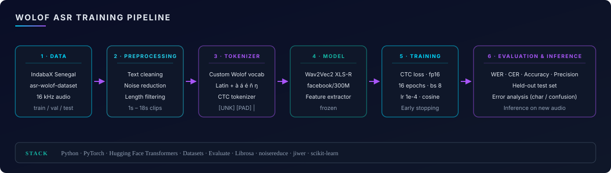
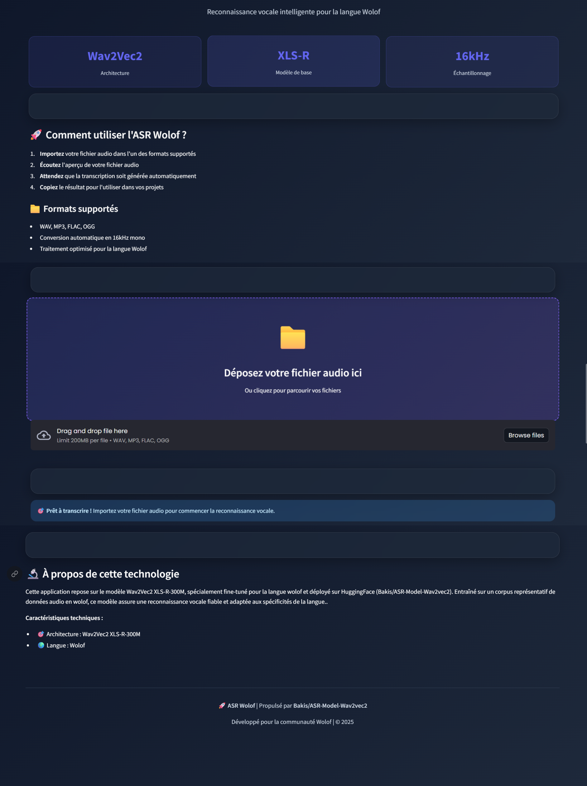
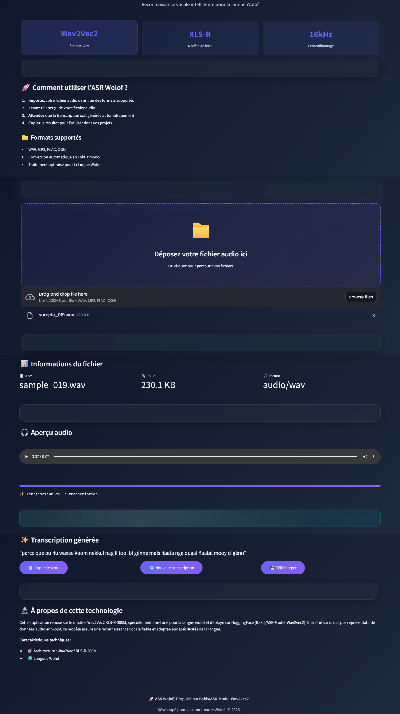
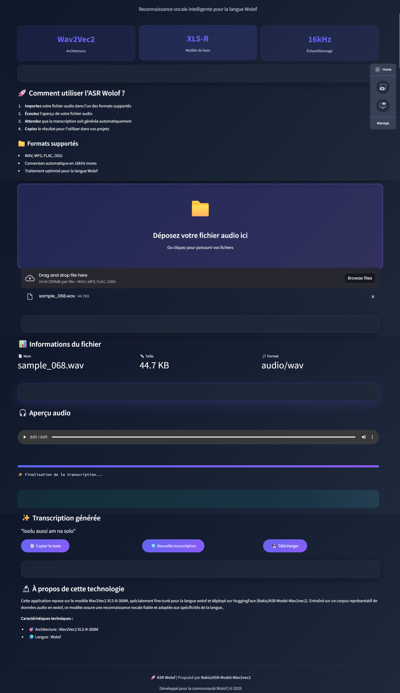
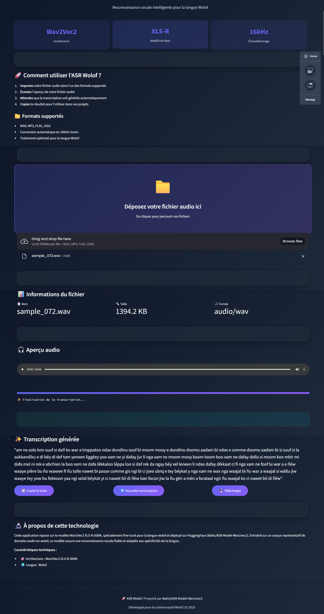
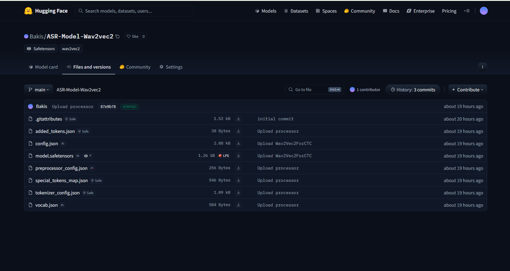

<p align="center">
  
</p>

<p align="center">
  
  
  
  
  
</p>

<p align="center">
  <a href="https://huggingface.co/Bakis/ASR-Model-Wav2vec2">
    
  </a>
</p>

<p align="center">
  <b>End-to-end Automatic Speech Recognition (ASR) pipeline for the Wolof language,</b><br/>
  fine-tuned from <code>facebook/wav2vec2-xls-r-300m</code> on the IndabaX Senegal corpus.<br/>
  <b>Ready-to-use model published on Hugging Face: <a href="https://huggingface.co/Bakis/ASR-Model-Wav2vec2"><code>Bakis/ASR-Model-Wav2vec2</code></a></b>
</p>

---

## Overview

Wolof is a language spoken by over 10 million people, primarily in Senegal, Gambia and Mauritania. Publicly available speech recognition models for Wolof remain scarce compared to high-resource languages.

This project fine-tunes **Wav2Vec2 XLS-R 300M** — a cross-lingual self-supervised speech representation model — on the IndabaX Senegal ASR dataset, and delivers a full training + evaluation + inference pipeline usable end-to-end.

**Best test result: WER ≈ 0.39** on the held-out test set.

---

## Pipeline

<p align="center">
  
</p>

| Step | What happens | Module |
|---|---|---|
| **1. Data** | Load train, validation and held-out test splits at 16 kHz | [`src/data.py`](src/data.py) |
| **2. Preprocessing** | Text cleaning, stationary noise reduction, length filtering (1–18 s, 4–310 tokens) | [`src/preprocessing.py`](src/preprocessing.py) |
| **3. Tokenizer** | Custom character-level vocabulary for Wolof (basic Latin + diacritics + `ŋ`, `ñ`) | [`src/vocab.py`](src/vocab.py) |
| **4. Model** | `Wav2Vec2ForCTC` with frozen feature extractor and CTC head | [`src/model.py`](src/model.py) |
| **5. Training** | 16 epochs, batch size 8, lr 1e-4, cosine scheduler, fp16, early stopping | [`src/trainer_setup.py`](src/trainer_setup.py) |
| **6. Evaluation** | WER / CER / accuracy / macro-precision, error analysis | [`src/metrics.py`](src/metrics.py) · [`src/evaluation.py`](src/evaluation.py) |
| **7. Inference** | Transcribe any audio file with optional denoising | [`src/inference.py`](src/inference.py) |

---

## Project structure

```text
asr-wolof-speech-recognition/
├── README.md
├── LICENSE
├── requirements.txt
├── .gitignore
│
├── notebooks/
│   └── wolof_asr_training.ipynb        Full exploratory notebook
│
├── src/                                 Modular pipeline
│   ├── config.py                        Central hyperparameters
│   ├── seeding.py                       Reproducibility
│   ├── data.py                          Dataset loading & text cleaning
│   ├── vocab.py                         Wolof vocabulary & processor
│   ├── preprocessing.py                 Noise reduction & feature encoding
│   ├── collator.py                      Padded CTC batches
│   ├── metrics.py                       WER / CER / accuracy / precision
│   ├── model.py                         Wav2Vec2 configuration
│   ├── trainer_setup.py                 TrainingArguments + Trainer builder
│   ├── evaluation.py                    Standalone evaluation loop
│   └── inference.py                     Load model + transcribe audio
│
├── scripts/
│   ├── train.py                         End-to-end training
│   ├── evaluate.py                      Evaluate on held-out test set
│   └── infer.py                         Transcribe a single audio file
│
├── app/                                 Streamlit web UI (deployable demo)
│   ├── streamlit_app.py                 Glassmorphism front-end
│   ├── requirements.txt                 App-only dependencies
│   ├── Dockerfile                       Production-ready container
│   ├── .dockerignore
│   └── README.md                        How to run & deploy the app
│
├── data/                                Dataset cache (git-ignored)
├── models/                              Saved models (git-ignored)
├── reports/                             Metrics & prediction CSVs (git-ignored)
├── assets/                              Banner, architecture, screenshots
│
└── .github/workflows/ci.yml             Lint on push
```

---

## Model & data

| | |
|---|---|
| Base model | [`facebook/wav2vec2-xls-r-300m`](https://huggingface.co/facebook/wav2vec2-xls-r-300m) |
| Training corpus | [`IndabaxSenegal/asr-wolof-dataset`](https://huggingface.co/datasets/IndabaxSenegal/asr-wolof-dataset) |
| Held-out test | [`IndabaxSenegal/asr-wolof-dataset-test`](https://huggingface.co/datasets/IndabaxSenegal/asr-wolof-dataset-test) |
| Sampling rate | 16 kHz mono |
| Clip length | 1 s – 18 s |
| Vocabulary | Character-level, Wolof-adapted (Latin + `à á â ã ä ç è é ê ë î ï ñ ò ó ô õ ù û ā ń ŋ`) |

---

## Results

| Metric | Value |
|---|---|
| **WER** (Word Error Rate) | **≈ 0.39** |
| CER (Character Error Rate) | reported per run in `reports/training_metrics.csv` |
| Token-level accuracy | tracked per eval step |
| Macro precision | tracked per eval step |

Detailed per-step metrics are saved to `reports/training_metrics.csv` during training.

---

## Installation

```bash
git clone https://github.com/KhalifaSeck/asr-wolof-speech-recognition.git
cd asr-wolof-speech-recognition

python -m venv .venv
source .venv/bin/activate      # Windows: .venv\Scripts\activate

pip install -r requirements.txt
```

A CUDA-enabled GPU is strongly recommended for training (fp16 is enabled by default).

---

## Live demo

An interactive **Streamlit web app** ships inside this repo, under [`app/`](app/). It wraps the Hugging Face model behind a polished glassmorphism UI where anyone can upload an audio file and get its Wolof transcription in seconds.

<p align="center">
  <a href="./app/"></a>
  <a href="https://huggingface.co/Bakis/ASR-Model-Wav2vec2"></a>
</p>

<p align="center">
  
  
</p>

### Real transcriptions produced live by the app

<table>
<tr>
<th width="50%">Short phrase</th>
<th width="50%">Long phrase</th>
</tr>
<tr>
<td></td>
<td></td>
</tr>
<tr>
<td><i>"loolu aussi am na solo"</i></td>
<td><i>"parce que bu ñu waxee koom nekkul nag li tool bi génne mais ñaata nga dugal ñaatal mooy ci génn"</i></td>
</tr>
</table>

### Model on Hugging Face

<p align="center">
  <a href="https://huggingface.co/Bakis/ASR-Model-Wav2vec2">
    
  </a>
</p>

**Run it locally in one line:**

```bash
cd app && pip install -r requirements.txt && streamlit run streamlit_app.py
```

Or with Docker: `cd app && docker build -t asr-wolof-app . && docker run --rm -p 8501:8501 --gpus all asr-wolof-app`

Full details in [`app/README.md`](app/README.md).

---

## Quick start — use the pretrained model

The trained model is available on Hugging Face and can be loaded directly, no training required.

```python
from transformers import Wav2Vec2ForCTC, Wav2Vec2Processor
import librosa, torch

MODEL_ID = "Bakis/ASR-Model-Wav2vec2"

processor = Wav2Vec2Processor.from_pretrained(MODEL_ID)
model = Wav2Vec2ForCTC.from_pretrained(MODEL_ID).eval()

audio, _ = librosa.load("hello_wolof.wav", sr=16_000, mono=True)
inputs = processor(audio, sampling_rate=16_000, return_tensors="pt")

with torch.no_grad():
    logits = model(inputs.input_values).logits

pred_ids = torch.argmax(logits, dim=-1)
print(processor.batch_decode(pred_ids)[0])
```

Or with this project's helpers:

```python
from src.inference import load_pretrained, transcribe_file

model, processor = load_pretrained("Bakis/ASR-Model-Wav2vec2", "Bakis/ASR-Model-Wav2vec2")
print(transcribe_file("hello_wolof.wav", model, processor))
```

From the CLI, point the inference script at the Hugging Face repo:

```bash
python -m scripts.infer path/to/audio.wav \
    --model-dir Bakis/ASR-Model-Wav2vec2 \
    --processor-dir Bakis/ASR-Model-Wav2vec2
```

---

## Usage

### Train from scratch

```bash
python -m scripts.train
```

The script downloads the dataset from Hugging Face, builds the Wolof vocabulary, encodes the audio, trains the model and writes checkpoints, the processor and per-step metrics into `wav2vec2-wolof-results/`.

### Evaluate on the held-out test set

```bash
python -m scripts.evaluate \
    --model-dir wav2vec2-wolof-results/model \
    --processor-dir wav2vec2-wolof-results/processor \
    --output-csv reports/test_predictions.csv
```

### Transcribe a single audio file

```bash
python -m scripts.infer path/to/audio.wav
```

Use `--no-denoise` to skip the stationary noise reduction step.

### Python API

```python
from src.inference import load_pretrained, transcribe_file

model, processor = load_pretrained(
    "wav2vec2-wolof-results/model",
    "wav2vec2-wolof-results/processor",
)
print(transcribe_file("hello_wolof.wav", model, processor))
```

---

## Configuration

All hyperparameters live in a single dataclass ([`src/config.py`](src/config.py)):

```python
@dataclass(frozen=True)
class Config:
    model_name: str = "facebook/wav2vec2-xls-r-300m"
    sampling_rate: int = 16_000
    max_input_length: int = 18
    min_input_length: int = 1
    max_tokens: int = 310
    batch_size_train: int = 8
    num_epochs: int = 16
    learning_rate: float = 1e-4
    warmup_ratio: float = 0.1
    early_stopping_patience: int = 3
    seed: int = 42
```

---

## Notebook

The full exploratory notebook that inspired this project is preserved at
[`notebooks/wolof_asr_training.ipynb`](notebooks/wolof_asr_training.ipynb).
The modular code under `src/` is the production-ready extraction of that notebook.

---

## Links

- 🎨 **Streamlit demo app** — [`app/`](app/) folder in this repo
- 🤗 **Model on Hugging Face** — https://huggingface.co/Bakis/ASR-Model-Wav2vec2
- 📊 **Training dataset** — https://huggingface.co/datasets/IndabaxSenegal/asr-wolof-dataset
- 🧪 **Test dataset** — https://huggingface.co/datasets/IndabaxSenegal/asr-wolof-dataset-test
- 🏗️ **Base model** — https://huggingface.co/facebook/wav2vec2-xls-r-300m

---

## License

Released under the [MIT License](LICENSE).
